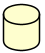

.. index:: UML Sequence diagram
   pair: diagram; UML Sequence diagram
   see: Sequence diagram; UML Sequence diagram

.. |ppt| replace:: **participant**

.. |ppts| replace:: **participant**

.. |ppt_ref| replace:: participant_

.. |ppts_ref| replace:: participant_

.. |is_the_frame_name| replace:: is the frame name in the pentagon in the upper left hand corner.

.. _sequence_diagram:

UML Sequence Diagram
####################

A UML Sequence diagram shows how messages go back and forth between objects over time. It is an *interaction diagram.*

The basic syntax for a line in a sequence diagram shows that one participant is sending a message to another participant:

   **participant   ->   the other participant: the message**

More formally:  :code:`<participant 1> <directional arrow> <participant 2>: <message>`

**Sequence diagram showing interaction between Alice and Bob:**

.. uml:: puml/sequence-1simple-bob-alice.puml

Here is the source for the diagram:

.. literalinclude:: puml/sequence-1simple-bob-alice.puml

.. index::
   pair: keywords; UML Sequence diagram

.. _seq_keywords:

********
Keywords
********

**Be sure to also read about the keywords and options that can be applied to all diagrams:**
:ref:`Global keywords and options <global_keywords_and_options>`

.. index:: participants
   pair: participants; UML Sequence diagram

============
Participants
============

.. todo::

   words about what participants are in general.  types...

.. index:: participant
   pair: participant; UML Sequence diagram
   pair: participant; as <alias>
   pair: participant; color
   pair: participant; order
   pair: participant; stereotype
   keyword: participant

.. _participant:

.. container:: keyword

   participant

:Usage:  :code:`participant "<display label>"`

         :code:`[ as <some alias> ]`

         :code:`[ #<color name | hexcode> ]`

         :code:`[ << [(<letter>, <color>)] [stereotype name] >>]`

         :code:`[ order <number> ]`

Participants are the *message senders.* \
Use the `participant` keyword to give a name to a message sender and optionally give it an alias and format it.

If the displayed label for a |ppt| has spaces or special characters, put quotes around it.  (Ex: :code:`"Request Handler"`)

You don't have to use the :code:`participant` keyword because PlantUML_ will automatically display a sender whenever it encounters one in the source.
But using the keyword gives you the ability to set the following options:

You can use a `participant` line anywhere in your source (at any time).
This is one way you can control the order of the participant boxes across the top.

:Options:

   .. index:: participant alias
      pair: participant alias; UML Sequence diagram
      pair: participant; alias
      keyword: as

  :as <some alias>: provide an alias for the participant.  This is useful if the displayed name is long; you can just use the shorter alias in the rest of the source.

      Ex: :code:`participant "Request Handler" as  RH`

   .. index:: participant color
      pair: participant color; UML Sequence diagram
      pair: participant; color

  :color #<colorName | hexCode>: set the color of the image displayed. Use a :doc:`color name<../formatting/color-names>` or hex code.

      Ex: :code:`participant Alice #lightGreen`

  :<< [(<letter>, <color name>)] [<stereotype text>] >>: (stereotype box) ...

      Ex: :code:`participant "Request Handler" << (S, #lightBlue) server >>`

  .. index:: participant order
      pair:  participant order; UML Sequence diagram
      pair:  participant; order
      keyword: order

  :order <number>: set the specific order for the participant.  Otherwise PlantUML_ just orders the participants as it encounters them.

      **order must come last else you'll get a syntax error!**

      Ex: :code:`participant "Request Handler" order 3`

:Example:

   .. uml:: puml/sequence-2-bob-alice.puml
      :scale: 100%

   .. literalinclude:: puml/sequence-2-bob-alice.puml

   You can show a message coming from or going to a participant not in the scope of the current diagram by using :code:`]` or :code:`[`

   * :code:`]` shows a message *going to* outside the scope of the diagram (to a participant not in the diagram)
   * :code:`[` shows a message *coming from* outside the scope of the diagram (from a participant not in the diagram)

.. index::
   pair: skinparam; participant

:Skinparams:

   :code:`Participant`

   :code:`ParticipantBorderThickness`

.. index:: actor
   pair: actor; UML Sequence diagram
   seealso: actor; participant
   keyword: actor

.. _seq_actor:

.. container:: keyword

   actor

:code:`actor` is a stereotype (synonym) for |ppt_ref| that displays a person stick figure instead of the standard box.  All of the same options as |ppt_ref| can be used.

         .. uml:: puml/seq-actor-simple-ex.puml
            :height: 100px

.. index::
   pair: skinparam; actor

:Skinparams:

   ActorBorderThickness

   Actor { }  -- note that the *last* Actor skinparams read will be the ones that are applied!

.. index:: boundary
   pair: boundary; UML Sequence diagram
   seealso: boundary; participant
   keyword: boundary

.. _seq_boundary:

.. container:: keyword

   boundary

.. image:: images/boundary.png
   :height: 25px
   :align: left
   :alt: a short vertical line connected with a horizontal line to a circle

:code:`boundary` is a stereotype (synonym) for |ppt_ref| that displays a boundary image instead of the standard box.  All of the same options as |ppt_ref| can be used.

         .. uml:: puml/seq-boundary-simple-ex.puml
            :height: 100px

.. index:: entity
   pair: entity; UML Sequence diagram
   seealso: entity; participant
   keyword: entity

.. _seq_entity:

.. container:: keyword

   entity

.. image:: images/entity.png
   :height: 25px
   :align: left
   :alt: a circle with a horizontal line under it

:code:`entity` is a stereotype (synonym) for |ppt_ref| that displays an entity image instead of the standard box.  All of the same options as |ppt_ref| can be used.

         .. uml:: puml/seq-entity-simple-ex.puml
            :height: 100px

.. index:: control
   pair: control; UML Sequence diagram
   keyword: control
   seealso: control; participant

.. _seq_control:

.. container:: keyword

   control

.. image:: images/control.png
   :height: 25px
   :align: left
   :alt: an arrow that points back to itself in a circle

:code:`control` is a stereotype (synonym) for |ppt_ref| that displays a control image instead of the standard box.  All of the same options as |ppt_ref| can be used.

         .. uml:: puml/seq-control-simple-ex.puml
            :height: 100px

.. index:: database
   pair: database; UML Sequence diagram
   seealso: database; participant
   keyword: database

.. _seq_database:

.. container:: keyword

   database

:code:`database` is asynonym for |ppt_ref| that displays a database image instead of the standard box.  All of the same options as |ppt_ref| can be used.

         .. uml:: puml/seq-database-simple-ex.puml
            :height: 100px

.. index:: create
   pair: UML Sequence diagram; create
   seealso: create; participant
   keyword: create

.. _seq_create:

.. container:: keyword

   create

:code:`create` puts the first occurrence of the diagram for the |ppt_ref| within the diagram where this word appears instead of at the top of the page.
Helps to show that an object is actually *created* at that point in time.

:Usage:  :code:`create` <name> :code:`order` <order number>

* cannot use "as"

            .. uml:: puml/seq-create-ex.puml
               :height: 150px

            .. literalinclude:: puml/seq-create-ex.puml

            In the example above, :code:`create "Auth System"` is used to show exactly when the *wrappedRequest* is created

.. index:: arrows (graphic paths)
   pair: UML Sequence diagram; arrows (graphic paths)
   see: graphic paths; arrows (graphic paths)
   see: messages; arrows (graphic paths)

.. _seq_arrows:

======================
Arrows (Graphic Paths)
======================

Arrows are used to show **messages** sent to and from |ppts_ref| along a *graphic path.*

.. index::
   pair: skinparam; arrows (graphic paths)

:Skinparams:

   Special note about arrows and skin params:  the *last* one is the one used.  (== an include and reference to ..?)

   :code:`ArrowThickness`

   Ex:  :code:`skinparam SequenceArrowThickness 4`

   Ex:  :code:`skinparam Sequence { ArrowThickness 4 }`

   :code:`MessageAlignment`

   :code:`MessageTextAlignment`

.. index:: arrow heads
   pair: arrows (graphic paths);  arrow heads
   pair: UML Sequence diagram;  arrow heads

.. _arrow heads:

-----------
Arrow Heads
-----------

Solid arrow heads represent *synchronous* messages.  Open (not filled in) arrow heads represent *asynchronous* messages.  (See the UML 2.5 Specification, section 17.4.4.1 Message Notation)

   :code:`>>`  creates an unfilled arrow pointing to the right (This is an *asynchronous* message.)

   :code:`<<`  creates an unfilled arrow pointing to the left (This is an *asynchronous* message.)

   :code:`>`  creates a filled (solid) arrow head pointing to the right (This is a *synchronous* message.)

   :code:`<`  creates a filled (solid) arrow head pointing to the left  (This is a *synchronous* message.)

   :code:`\\` creates the top half (only) of an unfilled arrow pointing to the right

   :code:`//` creates the bottom half (only) of an unfilled arrow pointing to the right

   :code:`\\` creates the top half (only) of a filled arrow pointing to the right

   :code:`/` creates the bottom half (only) of a filled arrow pointing to the right

   :code:`?` means the arrow line is short; it is only as long as the label for it.  If the :code:`?` is at the end, the arrow line is connected to the start (origin) and stops when the label for it stops.
   If the :code:`?` is at the end, then the arrow is connected to the end (target), and the arrow line is only as long as the arrow label.

   :code:`o` puts a final "o" at arrow head, denoting a *lost* message

   :code:`x` puts an ***X*** at the end, denoting a *destruction* message.

.. uml:: puml/seq-arrow-heads.puml
   :scale: 100 %

You can create a  bidirectional arrow by putting arrow heads at both ends of a line.  Ex:  :code:`<->`

.. index:: arrow lines
   pair: arrows (graphic paths);  arrow lines
   pair: UML Sequence diagram; arrow lines

.. _arrow_lines:

-----------
Arrow Lines
-----------

Solid lines show messages sent.  Dashed lines represent *reply* messages.

An object creation Message has a dashed line with an open arrow head.

   :code:`-` creates a solid line

   :code:`--` (two dashes instead of just one) creates dotted line

.. note::

   If you use dots :code:`...` for an arrow line, PlantUML_ will think you are working with a :ref:`Use Case diagram <use_case_diagram>` instead of a Sequence diagram
   and will change how it draws (renders) it.

You can make *dashed* :ref:`arrow lines <arrow_lines>` as long as you want, but they will be drawn only as long as needed and
calculated by Graphviz.

Ex:  You can do this:

.. literalinclude:: puml/seq-arrow-long.puml

And it will be rendered/drawn like this:

.. uml:: puml/seq-arrow-long.puml
         :scale: 100 %

.. index:: arrow color
   pair: arrows (graphic paths); arrow color
   pair: color; arrows (graphic paths)

.. _seq_arrow_color:

-----------
Arrow Color
-----------

You can change the color of an arrow by putting the color within square brackets just before the ending arrow-head characters:

Ex:  :code:`-[#magenta]>>`  will create a magenta colored unfilled arrow with a solid line

Ex:  :code:`--[#939393]>`  will create a gray colored filled arrow with a dashed line

.. uml:: puml/seq-arrow-colors.puml
         :scale: 100 %

.. index:: autonumber arrows
   pair: UML Sequence diagram; autonumber arrows
   pair: arrows (graphic paths); autonumber arrows
   pair: autonumber; arrows (graphic paths)
   keyword: autonumber

.. _seq_autonumber:

========================
Autonumber Graphic Paths
========================

.. container:: keyword

   autonumber

:Usage:     :code:`autonumber [start | resume ] [increment] [format]`

 - automatically number each arrow in the sequence

 - can format the numbering: "<b>(<u>##</u>)"

   - must be in double quotes
   - accepts simple printf type formatting (## 0  etc)

.. todo::

   autonumber

.. index::  start
   pair: UML Sequence diagram; autonumber start
   pair: autonumber; start
   pair: autonumber start; arrows (graphic paths)
   keyword: start

.. _seq_autonumber_start:

.. container:: keyword-option

   start

.. index::  resume
   pair: UML Sequence diagram; autonumber resume
   pair: autonumber; resume
   pair: autonumber resume; arrows (graphic paths)
   keyword: resume

.. _seq_autonumber_resume:

.. container:: keyword-option

   resume

.. index::  increment
   pair: UML Sequence diagram; autonumber increment
   pair: autonumber; increment
   pair: autonumber increment; arrows (graphic paths)
   keyword: increment

.. _seq_autonumber_increment:

.. container:: keyword-option

   increment

.. index::  autonumber stop
   pair: UML Sequence diagram; autonumber stop
   pair: autonumber; stop
   pair: autonumber stop; arrows (graphic paths)
   keyword: autonumber stop

.. _seq_autonumber_stop:

.. container:: keyword

   autonumber stop

.. todo::

   autonumber stop description

.. index:: lifeline
   pair: lifeline; UML Sequence diagram
   see: ExecutionSpecification; lifeline

.. _seq_lifelines:

==================================
Lifelines (ExecutionSpecification)
==================================

The :code:`activate` and :code:`deactivate` keywords are used to denote |ppt_ref| activation and deactivation on its lifeline.
The UML 2.5 specification refers to this as an ExecutionSpecification: exactly what messages are called, and in what order, are specified in this particular section of the diagram.

You can also explictly :code:`destroy` the lifeline of a |ppt_ref|, showing exactly when something is destroyed.

.. index::
   pair: skinparam; lifeline

:Skinparams:

   :code:`LifeLineBackgroundColor`

   :code:`LifeLineBorderColor`

   :code:`LifeLineBorderThickness`

.. index:: activate lifeline
   pair: activate lifeline; UML Sequence diagram
   pair: activate lifeline; lifeline
   keyword: activate

.. _seq_activate:

.. container:: keyword

   activate

:Usage:      :code:`activate <participant> [color]`

.. index:: deactivate lifeline
   pair: deactivate lifeline; lifeline
   pair: deactivate lifeline; UML Sequence diagram
   keyword: deactivate

.. _seq_deactivate:

.. container:: keyword

   deactivate

:Usage:        :code:`deactivate <participant>`

.. index:: destroy lifeline
   pair: destroy lifeline; lifeline
   pair: destroy lifeline; UML Sequence diagram
   keyword: destroy

.. _seq_destroy:

.. container:: keyword

   destroy

:Usage:        :code:`destroy <participant>`

.. index:: frame
   pair: frame; UML Sequence diagram
   seealso: box; frame
   see: grouping box; frame

.. _seq_frames:

=======================
Frames Around Fragments
=======================

Frames are rectangular boxes around a fragment (or sub-clause) of a sequence.  It is a box around certain participants and messages.
There is a name in the upper-left corner of the frame and, in the case of a :ref:`group box <seq_frame_group>`,  optionally a label across the top of the frame.

* All frame keywords **must have a corresponding** :code:`end` to signal where the frame ends
* You can nest frames
* You cannot use a `note` within a frame
* See section 17.6 in the UML 2.5 Specification
* PlantUML_ does not implement all InteractionOperator kinds, but you can use the :ref:`group box <seq_frame_group>` to put in the name of any InteractionOperator you want.

.. index::
   pair: skinparam; frame

:Skinparam:

   Even though these skinparams start with :code:`Group` they apply to all frames.

   * The :code:`GroupHeaderFont` formats the text that appears in the pentagon in the upper-left-hand corner of the frame. |skinparam_specs|

      :code:`GroupHeaderFontColor`

      :code:`GroupHeaderFontName`

      :code:`GroupHeaderFontSize`

      :code:`GroupHeaderFontStyle`

   * :code:`GroupBodyBackgroundColor` formats that background color of the frame. |skinparam_specs|

      :code:`GroupBorder` formats the border of the frame.

      :code:`GroupBorderColor`

      :code:`GroupBorderThickness`

   * :code:`GroupFont` formats the text at the top of the frame. |skinparam_specs|

      :code:`GroupFontColor`

      :code:`GroupFontName`

      :code:`GroupFontSize`

      :code:`GroupFontStyle`

.. index:: alternatives frame
   pair: UML Sequence diagram; alternatives frame
   pair: frame; alternatives
   seealso: alt; alternatives frame
   keyword: alt

.. _seq_frame_alt:

.. container:: keyword

   alt

:Usage:  :code:`alt "<text>"`

         :code:`<... whatever goes within the box ... >`

         :code:`end`

         InteractionOperator *alt* is used to show one or more *alternative* sequences that can happen.  A dashed line
         is used between the possible alternative sequences.

         *alt* |is_the_frame_name|

         *text* is displayed in square brackets (:code:`[]`) at the top of the frame; it describes or labels frame as a whole.

.. index:: else frame
   pair: alternatives frame; else frame
   pair: UML Sequence diagram; else frame
   pair: frame; else
   seealso: else; else frame
   keyword: else

.. _seq_frame_alt_else:

.. container:: keyword

   else

:Usage:  :code:`else "<text>"`

         :code:`<... whatever goes within the box ... >`

         :code:`end`

         In the UML specification, *else* is the default sequence in a list of :ref:`alternative <seq_frame_alt>` sequences.
         The *else* InteractionOperator is used to show the sequence that will be used if the none of conditions for
         the *alt* alternatives can be met.  *else* |is_the_frame_name|

         But in **PlantUML_** this is how you label different alternatives.  You can use the :ref:`group <seq_frame_group>`
         keyword to specifically display the word "else" and use it per the UML Specification.

         *text* is displayed in square brackets (:code:`[]`) at the top of the frame; it describes or labels this alternative.

:Example:

.. uml:: puml/seq-ex-alt-else-text-from-UML25-figure17-13.puml
   :align: center
   :scale: 120%

.. index:: opt frame
   pair: UML Sequence diagram;  opt frame
   pair: frame; opt
   seealso: opt; opt frame
   keyword: opt

.. _seq_frame_opt:

.. container:: keyword

   opt

:Usage:  :code:`opt "<text>"`

         :code:`<... whatever goes within the box ... >`

         :code:`end`

         An *optional* sequence.  It either happens or not.

         *opt* |is_the_frame_name|

         *text* is displayed in square brackets (:code:`[]`) at the top of the frame; it describes or labels frame as a whole.

.. index:: loop frame
   pair: UML Sequence diagram; loop frame
   pair: frame;loop
   seealso: loop; loop frame
   keyword: loop

.. _seq_frame_loop:

.. container:: keyword

   loop

:Usage:  :code:`loop "<text>"`

         :code:`<... whatever goes within the box ... >`

         :code:`end`

         Shows a sequence that *loops*.

         *loop* |is_the_frame_name|

         *text* is displayed in square brackets (:code:`[]`) at the top of the frame; it describes or labels frame as a whole.

.. index:: parallel frame
   pair: UML Sequence diagram; parallel frame
   pair:  frame; parallel
   seealso: par; parallel frame
   keyword: par

.. _seq_frame_par:

.. container:: keyword

   par

:Usage:  :code:`par "<text>"`

         :code:`<... whatever goes within the box ... >`

         :code:`end`

         Shows a *parallel* sequence.

         *par* |is_the_frame_name|

         *text* is displayed in square brackets (:code:`[]`) at the top of the frame; it describes or labels frame as a whole.

.. index:: break frame
   pair: UML Sequence diagram; break frame
   pair:  frame;break
   seealso: break; break frame
   keyword: break

.. _seq_frame_break:

.. container:: keyword

   break

:Usage:  :code:`break <text>`

         :code:`<... whatever goes within the box ... >`

         :code:`end`

         shows that a sequence breaks.  It stops (does not perform) any of the remaining sequence does this instead.

         *break* |is_the_frame_name|

         *text* is displayed in square brackets (:code:`[]`) at the top of the frame; it describes or labels frame as a whole.

.. index:: critical frame
   pair: UML Sequence diagram; critical frame
   pair:  frame;critical
   seealso: critical; critical frame
   keyword: critical

.. _seq_frame_critical:

.. container:: keyword

   critical

:Usage:  :code:`critical "<text>"`

         :code:`<... whatever goes within the box ... >`

         :code:`end`

         A fragment of a sequence that cannot be "interleaved" by other fragments (e.g. parallel fragments, etc.).

         *critical* |is_the_frame_name|

         *text* is displayed in square brackets (:code:`[]`) at the top of the frame; it describes or labels frame as a whole.

.. index:: group frame
   pair: UML Sequence diagram; group frame
   pair: frame; group
   seealso: group; group frame
   keyword: group

.. _seq_frame_group:

.. container:: keyword

   group

:Usage:  :code:`group "<frame name>"`

         :code:`<... whatever goes within the box ... >`

         :code:`end`

          allows you to fully specify the frame name.

          *frame name* |is_the_frame_name|

          Note that you cannot add *text* after the frame name.

.. todo::

   Example for different frames

.. index:: reference frame
   pair: UML Sequence diagram; reference frame
   pair: reference; frame
   see: InteractionUse frame; reference frame
   seealso: ref; reference frame
   keyword: ref

.. _seq_reference_frame:

================================
Reference Frame (InteractionUse)
================================

.. container:: keyword

   ref

:Usage:  :code:`ref "<frame name>"`

          A *reference* to some other interaction or diagram.
          *ref* |is_the_frame_name|

.. index::
   pair: skinparam; reference frame

:Skinparam:

       ReferenceAlignment
       ReferenceBackgroundColor
       ReferenceBorderColor
       ReferenceBorderThickness
       ReferenceFontColor
       ReferenceFontName
       ReferenceFontSize
       ReferenceFontStyle
       ReferenceHeaderBackgroundColor

.. todo::

   example for reference frame

.. index:: delay
   pair:  UML Sequence diagram; delay
   keyword: delay

.. _seq_delay:

.. container:: keyword

   delay

:Usage:  :code:`... [<text> ...]`

         Indicates a delay in the diagram. You can optionally add text to describe the delay.

.. index::
   pair: skinparam; delay

:Skinparam:

       DelayFontColor
       DelayFontName
       DelayFontSize
       DelayFontStyle

.. todo::

   Example for delay

.. index:: spacing
   pair: UML Sequence diagram; spacing

.. _seq_spacing:

=======
Spacing
=======

* |||  or || <number of pixels> ||

.. todo::

   spacing - complete it + example

.. index:: divider
   pair: UML Sequence diagram; divider

.. _seq_dividers:

========
Dividers
========

.. index::
   pair: skinparam; divider

:Skinparam:

       DividerBackgroundColor
       DividerBorderColor
       DividerBorderThickness
       DividerFontColor
       DividerFontName
       DividerFontSize
       DividerFontStyle

.. todo::

   dividers - complete it + example

.. index:: note
   pair: note;  UML Sequence diagram
   keyword: note

.. _seq_notes:

=====
Notes
=====

.. index:: participant note
   pair: participant; note
   pair: UML Sequence diagram; participant note

.. _seq_notes_participants:

----------------------
Notes for Participants
----------------------

* for participants:

  - put this under section about participants?

.. index:: arrow note
   pair: arrows (graphic paths); note
   pair: UML Sequence diagram; arrow note

.. _seq_notes_arrows:

----------------
Notes for Arrows
----------------

* for arrows (graphic paths) (messages)

  - put this info under the section about graphic paths?

.. index:: newpage
   pair: newpage;  UML Sequence diagram
   see: new page; newpage
   see: page break; newpage
   keyword: newpage

.. _seq_newpage:

.. container:: keyword

   newpage

.. todo::  newpage - is this common?  or only on sequence diagrams?

**A longer sequence of events with some skinparam styles used:**

.. uml:: puml/sequence-2complex.puml
   :scale: 100 %
   :caption: :doc:`View the source for this diagram here <puml/sequence-2complex-source>`

.. index::
   pair: skinparam; UML Sequence diagram

****************************************
Skinparams specific to Sequence Diagrams
****************************************

.. todo::

   link each of these to skinparams

.. code:: text

   Sequence {

      General:

          TitleFontColor
          TitleFontName
          TitleFontSize
          TitleFontStyle

          NewpageSeparatorColor

       ActorBorderThickness

       ArrowThickness

       DelayFontColor
       DelayFontName
       DelayFontSize
       DelayFontStyle

       DividerBackgroundColor
       DividerBorderColor
       DividerBorderThickness
       DividerFontColor
       DividerFontName
       DividerFontSize
       DividerFontStyle

       GroupBackgroundColor
       GroupBodyBackgroundColor
       GroupBorderColor
       GroupBorderThickness
       GroupFontColor
       GroupFontName
       GroupFontSize
       GroupFontStyle
       GroupHeaderFontColor
       GroupHeaderFontName
       GroupHeaderFontSize
       GroupHeaderFontStyle

       LifeLineBackgroundColor
       LifeLineBorderColor
       LifeLineBorderThickness

       MessageAlignment
       MessageTextAlignment

       Participant
       ParticipantBorderThickness

       ReferenceAlignment
       ReferenceBackgroundColor
       ReferenceBorderColor
       ReferenceBorderThickness
       ReferenceFontColor
       ReferenceFontName
       ReferenceFontSize
       ReferenceFontStyle
       ReferenceHeaderBackgroundColor

   Misc (not [yet] associated with a keyword or option):

       BoxBackgroundColor
       BoxBorderColor
       BoxFontColor
       BoxFontName
       BoxFontSize
       BoxFontStyle

       StereotypeFontColor
       StereotypeFontName
       StereotypeFontSize
       StereotypeFontStyle

   }

